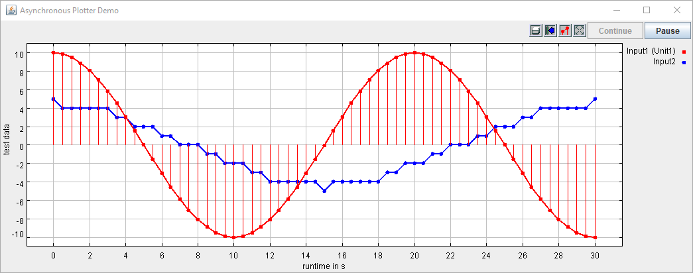

*******************
AIT Lablink Plotter
*******************

.. meta::
   :description lang=en: AIT Lablink plotter

This package provides LabLink clients that visualize data as plotted graphs in a separate window.
These plotted graphs are continuously updated while the client is running, showing the input data as a function of time.

The LabLink clients provided by this package are:

* *PlotterAsync*: this client runs asynchronously and plots new data points as a function of wall-clock time
* *PlotterSync*: this client runs synchronoulsy (i.e., synchronized by a `sync host <https://github.com/AIT-Lablink/lablink-sync-host>`__) and plots new data points as a function of synchronization time

   

Installation
============

Find information about the installation of the Lablink plotter clients :doc:`here <installation>`.

.. toctree::
   :maxdepth: 2
   :hidden:
   :caption: Installation

   /installation
   
Running the clients
===================

Find basic instructions for running the clients :doc:`here <running>`.

.. toctree::
   :maxdepth: 2
   :hidden:
   :caption: Running the clients

   /running

Configuration
=============

Find the reference for writing a configuration for a Lablink plotter client :doc:`here <configuration>`.

.. toctree::
   :maxdepth: 2
   :hidden:
   :caption: Configuration

   /configuration

Examples
========

Find step-by-step instructions for running the examples :doc:`here <examples>`.

.. toctree::
   :maxdepth: 2
   :hidden:
   :caption: Examples

   /examples
